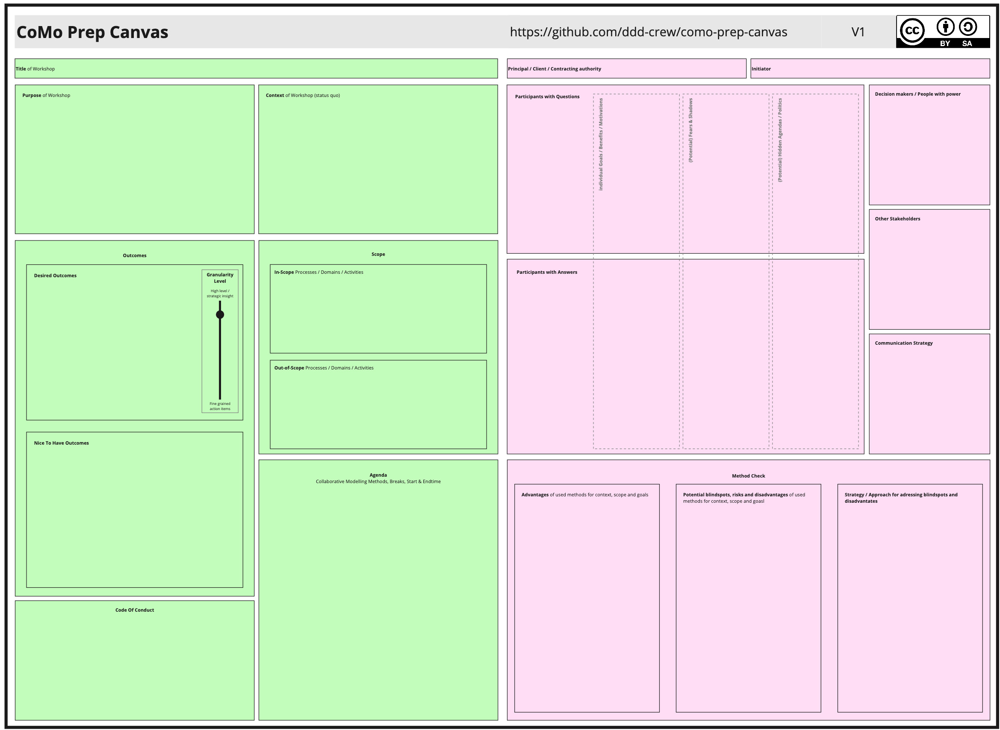

# Collaborative Modeling Workshop Preparation Canvas

The “Collaborative Modeling Workshop Preparation Canvas” is a tool to support facilitators when preparing for collaborative modelling (CoMo) workshops. The canvas is split into two primary areas:

1. **Green Sections** – These are **public** and can be shared with the entire group (participants, sponsors, and stakeholders) both before and during the workshop.  
2. **Pink Sections** – These are **private** and intended **only for facilitators (and their close collaborators)** who need to manage deeper workshop logistics, hidden agendas, and sensitive information.

---

## 1\. When and Why to use the Canvas

The canvas is not only supposed to guide rather new facilitators but also provide a structured guide to already experienced ones. The structured approach is designed to help you to be less biased by recent experiences to engage with each workshop anew.

### 1.1 Preparing Workshops in challenging environments 

The canvas is designed to help you when facing rather challenging settings. It will guide you through in your preparation and help you to better understand the environment (goal, status quo & people). It will also support you to make your own assumptions transparent to be able to challenge them. By going through the different sections and related questions, the canvas helps you to effectively prepare the workshop's outline (storyline, communication strategy, shared goal).

### 1.2 Finding blind spots in deceptively easy settings (Identifying challenging environments)

The Collaborative Modeling Workshop Preparation Canvas can also serve as a diagnostic tool to identify potentially challenging workshop environments and find blind spots in deceptively easy settings. Certain patterns or triggers during the canvas completion process may indicate complexity or difficulties. 

The green sections, when shared with stakeholders beforehand, should help you to find misunderstandings during preparation and are designed to be used as a baseline for your communicating with the initiator, authority and/or participants before and during the workshop. The pink sections might help you to find the gaps in your own mental model and look behind the curtains.

## 2\. Overall Canvas Structure

Use this documentation as reference while filling out each field. 

1. **Header Sections**  
     
   - **Title of Workshop**  
   - **Principal / Client / Contracting Authority**  
   - **Initiator**

   

2. **Green (Public) Panels**  
     
   - **Purpose of Workshop**  
   - **Context of Workshop (Status Quo)**  
   - **Outcomes** (Desired Outcomes, Granularity Level, Nice-to-Have Outcomes)  
   - **Scope** (In-Scope, Out-of-Scope)  
   - **Agenda**  
   - **Code of Conduct**

   

3. **Pink (Private) Panels**  
     
   - **Participants with Questions**  
   - **Participants with Answers**  
   - **Individual goals, benefits and motivation, (Potential) fears and shadows & (Potential) Hidden Agendas / Politics**  
   - **Decision makers / People with power**   
   - **Other Stakeholders**  
   - **Communication Strategy**  
   - **Method Check** (Advantages, Blindspots, Risks, Coping Strategies)

Below is a more detailed explanation for each section, with examples. The examples included are simplified illustrations of what real content might look like.

---

## 2\. Header Sections

### 2.1 Title of Workshop

- **What to include:**  
  A clear, concise name for the upcoming collaborative modeling session.  
    
- **Why it matters:**  
  This title sets expectations and gives the workshop a clear identity from the outset and should be aligned with the goal and scope of the workshop. If you struggle in finding a concise title for the workshop, the goal and scope might not be clear enough yet. Same applies if the title is not understood by stakeholders without further explanation. 

**Example:**

**“EventStorming Workshop: Improving the Order Fulfillment Process”**

---

### 2.2 Principal / Client / Contracting Authority

- **What to include:**  
  The person or organization requesting (and financing) the workshop, or the authority sponsoring it.  
    
- **Why it matters:**  
  Sometimes your main conact / the initiator is not the one ultimately responsible for the workshop and its results. It is important to be clear about this and to clarify for the expectations and their definition of success beforehand. Dont rely on your contact to do this for you. Chinese whispers in crease the chances of unwanted surprises. It is also important to know who is allowed to decide / what can be decided during the workshop itself. 

**Example:**

*Client:* Logistics Department of XYZ Company

---

### 2.3 Initiator

- **What to include:**  
  The individual or group who had the idea for the workshop or championed its need.  
    
- **Why it matters:**  
  Understanding who brought the workshop to life helps clarify motivations and possible goals. They often provide valuable background information to the status quo and the people involved.  They are your lever into the company / department / team, but they might also have their hidden agenda in doing so. Try to find out as much as possible about the people joining the workshop, e.g. fears, hidden agendas, potential goals/stakes (see below). But also be aware they might be wrong / it's just one opinion. You can use the Setting the Stage sessions to get more insights yourself.

**Example:**

*Initiator:* Head of Supply Chain Innovation at XYZ Company

---

## 3\. Green Panels (Public)

These are public and can be shared with the entire group (participants, sponsors, and stakeholders) both before and during the workshop.

### 3.1 Purpose of Workshop

- **What to include:**  
    
  - The main reason for running this workshop.  
  - High-level objectives or what problem it tries to address.  
  - Definition of success

- **Why it matters:**  
  It is important that you are clear abourt the problem you wnat to solve. This can be a process together with the stakeholders. Knowing and actually understanding the problem is often already the first step. If you want to share the green section with the workshop participants beforehand, make sure you phrase it in a way that it can be perceived as a win-win situation/chance. Here it helps to be aware of the shadows of the people.   
  Try not to solve too many problems at the same time and help your stakeholders to pinpoint the challenge they want to tackle in this workshop. It still helps the have a greater goal or subsequent goals to get the bigger picture od the workshop. 

**Example:**

**Purpose:** To identify process bottlenecks in our current order-to-delivery workflow and collaboratively propose improvements.

---

### 3.2 Context of Workshop (Status Quo)

- **What to include:**  
    
  - A short summary of the current situation leading to the workshop.  
  - Key facts, constraints, and any relevant history.

- **Why it matters:**  
  Provides a baseline for all participants so that they enter the workshop on the same page. This should best case be shared beforehand as well as in the beginning of the workshop.

**Example:**

**Context:**

- Currently, our average delivery time has increased from 2 days to 5 days in the last quarter.  
- Customer complaints have risen by 40%.  
- Multiple departments (Sales, Warehouse, Shipping) have overlapping responsibilities but lack clear communication.

---

### 3.3 Outcomes

#### 3.3.1 Desired Outcomes

- **What to include:**  
    
  - Core goals that must be achieved by the end of the workshop.  
  - Typically phrased as bullet points or short statements of success.

- **Why it matters:**  
  Guides facilitators and participants in focusing on what truly needs to get done. Trying to think about how success would look like helps you to get in the mindset to solve problems but also to understand them better. It also helps to find the right methods for the workshop and to manage expectations (e.g. what is possible vs. what would be wished for in an ideal world)

**Example:**

- A shared map of the “Order Fulfillment” domain and key events.  
- A prioritized list of bottlenecks and possible interventions.  
- Agreement on next steps to pilot one key improvement.

#### 3.3.2 Granularity Level

- **What to include:**  
    
  - An indication of how detailed the modeling or discussion is intended to be, from very high-level to very detailed.

- **Why it matters:**  
  Aligns expectations regarding how deeply to dive into each topic.

**Example (Scale):**

“We will focus on a mid-level granularity: We want to capture major events and responsibilities without diving into every IT system detail.”

#### 3.3.3 Nice-to-Have Outcomes

- **What to include:**  
    
  - Additional, non-critical objectives that are beneficial but not mandatory.

- **Why it matters:**  
  Helps facilitators prioritize if time is limited. If time remains, you can address these. Sometimes it's easier for stakeholders to deprioritise their expectations rather than skipping them completely. They can also serve as potential follow ups after the workshop

**Example:**

- Gather preliminary metrics for potential ROI of proposed improvements.  
- Explore a rough timeline for system integration changes.

---

### 3.4 Scope

#### 3.4.1 In-Scope Processes / Domains / Activities

- **What to include:**  
    
  - The specific processes, departments, or activities the workshop *will* examine.

- **Why it matters:**  
  Helps set boundaries so that discussions remain productive and relevant. Helps to set expectations and to understand the problem better. It should also help your to know who should be invited 

**Example:**

- Order submission (Sales)  
- Inventory checks (Warehouse)  
- Shipping & Tracking (Logistics)

#### 3.4.2 Out-of-Scope Processes / Domains / Activities

- **What to include:**  
    
  - The processes, departments, or activities the workshop *will not* address.

- **Why it matters:**  
  Prevents scope creep and ensures participants do not derail the workshop with irrelevant concerns. Sometimes it is easier to pinpoint what is out of scope then in scope. By asking for both you can more easily adapt to your stakeholder group and open up new perspectives. 

**Example:**

- Payment processing (handled separately by Finance)  
- Customer support ticketing (handled by Customer Service after delivery)

---

### 3.5 Agenda

- **What to include:**  
    
  - The structure of the workshop: methods used, timings, breaks, and start/end times.  
  - High-level schedule or timeline.

- **Why it matters:**  
  Ensures participants know how the workshop will flow and when each activity will happen. The more the participants know the better they can prepare and it helps you to set expectations. There is no need to explain every method on detail but to share the overall storyline through the workshop. Explain the “why” of each method. It also increases trust and confidence in you as facilitator as you show that you have a plan.

**Example:**

1. **9:00 – 9:15** Introduction & objectives  
2. **9:15 – 10:30** EventStorming: mapping order events  
3. **10:30 – 10:45** Break  
4. **10:45 – 12:00** Identifying bottlenecks & potential improvements  
5. **12:00 – 12:30** Discussion of next steps and wrap-up

---

### 3.6 Code of Conduct

- **What to include:**  
    
  - A set of ground rules that ensure respectful and productive collaboration.

- **Why it matters:**  
  Reinforces a positive workshop environment and sets behavioral expectations.

**Example:**

- Everyone’s input is valid—no idea is dismissed prematurely.  
- One person talks at a time—no side conversations.  
- Maintain confidentiality when asked.  
- Address issues, not personalities.

---

## 4\. Pink Panels (Private)

These panels are meant for the facilitator’s eyes and their close collaborators. They contain more sensitive or strategic considerations that need to be managed discreetly. You can use your consideration from the pink side to gather more information for the green side and vice versa.

### 4.1 Participants with Questions

- **What to include:**  
    
  - Participants with knowledge gaps seeking for answers.

- **Why it matters:**  
  Helps facilitators plan how to clarify concepts and provide background during the workshop. If you only have people with answers, you don't have anyone to ask them and you as facilitator might be the only one asking questions which can be quite a bottleneck. Sometimes the people with the answers are the same as the ones with the questions (curious for the other departments) but this is not always the case to better be prepared. 

**Example:**

- Jessica (New Warehouse Manager) might need basic Domain Storytelling guidance.  
- Dan (IT Project Lead) may ask about integration with legacy systems.  
- Dev Team wanting to know more about the business side.

---

### 4.2 Participants with Answers

- **What to include:**  
    
  - Participants having deep knowledge or specialized expertise.  
  - Pinpoint who can clarify certain domain aspects if questions arise.

- **Why it matters:**  
  Allows the facilitator to strategically engage the right people at the right time. If you don't include people with answers you end up with only assumptions.

**Example:**

- Mario (Shipping Specialist) knows exact shipping procedures.  
- Rhea (Business Analyst) is aware of existing metrics and performance data.  
- Financial department working with the legacy software on a day to day basis.

### 4.3 Individual goals, benefits and motivation, (Potential) fears and shadows & (Potential) Hidden Agendas / Politics

- **What to include:**

- Any potential personal or departmental interests that could shape the workshop’s discussions.  
- Known conflicts between individuals or teams.  
- Known or assumed fears of individuals and/or whole teams.  
- Known or potential team/power dynamics or implicit rules.

- **Why it matters:**  
  Being aware of hidden motivations can help you design facilitation techniques that keep the workshop constructive. It also helps you in finding a suitable goal everyone agrees on (win-win situation) and to better navigate group dynamics by understanding their reasoning. 

**Example:**

- The Warehouse team might want to invest in automation; the Logistics team might prefer more manual checks for accuracy.  
- A manager who is resistant to change may try to block new ideas.

---

### 4.4 Decision makers / People with power

- **What to include:**   
    
  - Key decision-makers for any proposed outcomes or next steps.  
  - Formal Leaders with official titles or authority (e.g., managers, department heads).   
  - Informal Leaders who may not hold official titles but have significant influence or respect within the group.  
      
- **Why it matters:**  
  Knowing who has the authority to approve or implement changes will help you manage expectations and ensure that the workshop leads to actionable results. The support and alignment of formal leadership roles are crucial for the success of the workshop as they can interfere unexpectedly. Identifying and engaging with informal leaders can also be essential as their opinion and motivation often highly influences the group dynamics.

**Example:**

- CFO, since proposed improvements might require budget.  
- HR Department, if staffing changes might result from process improvements.  
- Most senior colleagues in the team.

### 4.5 Other Stakeholders

- **What to include:**  
    
  - Individuals or groups not directly in the workshop but potentially affected by the outcomes.  
  - Any high-level sponsors or department heads who might influence or be influenced by the results.

- **Why it matters:**  
  Helps the facilitator consider who to inform or loop in later and plan communication accordingly. Make sure you don't have any people in the workshop which just want to watch. Try to find a task for them as well or offer to inform then afterwards about the results. They often highly influence the group dynamics. 

**Example:**

- CFO, since proposed improvements might require budget.  
- HR Department, if staffing changes might result from process improvements.

---

### 4.6 Communication Strategy

- **What to include:**  
    
  - How you (the facilitator) plan to communicate with participants and stakeholders before, during, and after the workshop. (when, who, what)  
  - Which channels (email, Slack, in-person, etc.) will be used.

- **Why it matters:**  
  Proper communication keeps everyone aligned and manages expectations. Depending on the environment it is required to get everyone on board at the same time so no-one feels left out. Sometimes higher management positions refer a prior check in. Make sure you have the participants on your side and motivated for the workshop. 

**Example:**

- Pre-workshop questionnaire via email.  
- Slack channel for real-time Q\&A.  
- Post-workshop summary circulated to all participants and sponsors.  
- Setting the stage sessions with all participants before the workshop

---

### 4.7 Method Check

#### 4.7.1 Advantages of Used Methods for Context, Scope, and Goals

- **What to include:**  
    
  - Why you chose EventStorming, Domain Storytelling, or other modeling methods.  
  - Specific strengths of each method that help achieve the goals.

- **Why it matters:**  
  Helps you be clear on why these methods fit well, and how to leverage their strong points. The clearer you are on your storyline the easier it is to follow for the participants. 

**Example:**

- **EventStorming**: Great for quickly visualizing an end-to-end process, identifying bottlenecks, and engaging non-technical people.  
- **Domain Storytelling**: Excellent for clarifying roles and interactions in complex processes.

---

#### 4.7.2 Potential Blindspots, Risks, and Disadvantages of Used Methods

- **What to include:**  
    
  - Known issues or limitations in your chosen methods.  
  - Possible pitfalls (e.g., groupthink, time constraints) to watch out for.

- **Why it matters:**  
  Allows facilitators to anticipate problems and prepare mitigations. Being aware of there makes it easier to try out different methods and to adapt the workshop on the spot as not everything can be anticipated. 

**Example:**

- EventStorming can become chaotic if too many participants talk at once.  
- Domain Storytelling can be time-intensive if the domain is very large.

---

#### 4.7.3 Strategy / Approach for Addressing Blindspots and Disadvantages

- **What to include:**  
    
  - Your plan to handle or minimize the limitations identified above.  
  - Concrete steps or facilitation techniques to keep the workshop on track.

- **Why it matters:**  
  Equips you with a “backup plan” so you can confidently guide discussions.

**Example:**

- Pre-divide the domain into manageable slices to avoid “analysis paralysis.”  
- Assign a co-facilitator to manage group discussions, keep to time boxes, and make sure all voices are heard.

---

## 5\. How to use this canvas

***…iterate iterate iterate…***

##### Before the workshop

- Try to fill out as much as you can during/after each meeting you have with the stakeholders (green & pink).   
- Make your assumptions tangible  
- Identify open questions  
- Try to gain more insights based on your assumptions and open questions.   
- Adapt the communication strategy and agenda along the way. Think about adding the sharing of the green sections to your communication strategy. 

##### After the workshop 

You can use the canvas together with the outcomes of the workshop to plan further follow ups and to reflect on your own preparation (e.g. shared goal, communication strategy, storyline, understanding your stakeholders and their hidden agendas, …). 

## 6\. Potential triggers and patterns indicating a challenging environment

- **Difficulty Defining the "Purpose of Workshop" or "Outcomes":** If stakeholders struggle to articulate clear goals or success criteria, it may indicate conflicting priorities or a lack of shared understanding.  
- **Extensive "Hidden Agendas / Politics" Entries:** A long list in this section suggests a highly politicized environment with potential conflicts or resistance.  
- **Many different individual goals:** If you have many parties with very different or even contradicting (at first sight) subgoals you should invest enough time in scoping sessions to find the overarching goal to create a win-win situation.   
- **Hard to find a goal that unites all interests:** If you cannot agree on a (even very high level) goal that unites all stakeholders, try to understand what's behind the different interests, which fears might be under the hood. (Either as part of the preparation e.g. in setting the stage sessions and scoping calls, during pre-workshops or as part of the actual workshop)   
- **Disagreement on "Scope":** If defining what is in or out of scope leads to significant debate or disagreement, it may signal differing expectations or underlying power struggles.  
- **Unclear "Principal / Client / Contracting Authority" or "Initiator":** Ambiguity about who is ultimately responsible or driving the workshop can lead to confusion and challenges. It should be clear before the workshop who is able to decide what / how decisions are made. If this is not possible / unknown, have it as part of the workshop to find it out.   
- **Complex "Participants with Questions" or "Participants with Answers":** A diverse group e.g. extroverts vs introverts or highly varied knowledge levels may require more tailored facilitation techniques.  
- **Only people with questions / only people with answers:** If you realise you only have people from one side in the canvas, you should be clear about its effects. Only people with questions will lead to many assumptions without any chance for clarification during the workshop. Only people with answers, but no-one to ask will make you a bottle neck as facilitator. Sometimes the people with the answers and people with questions can be the same, but with different hidden agendas and/or fears.  
- **Vague or Contradictory "Context of Workshop":** If stakeholders provide conflicting accounts of the current situation, it may indicate a lack of transparency or underlying issues.

---

## 7\. Tips & Best Practices

- **Keep It Simple:**  
  Do not overload the canvas with text. Aim for clarity and brevity in each box. Depending on the workshop you might not need to fill all the boxes.  
    
- **Use Bullets & Visuals:**  
  Where possible, use bullet points, symbols, or short statements to keep the canvas easy to scan.  
    
- **Iterate as Needed:**  
  This canvas might evolve during preparation. Revisit each section as you learn new information.  
    
- **Leverage Co-Facilitators:**  
  Involving a co-facilitator or a small preparation team can help fill the pink sections objectively and thoroughly.  
    
- **Adapt to Your Context:**  
  Each workshop is different; customize or rename sections if it suits your organization’s language and culture better.

---

# Conclusion

The **Collaborative Modeling Workshop Preparation Canvas** is designed to ensure a thorough, well-managed, and transparent preparation process. By distinguishing **public** (green) areas that keep everyone aligned from **private** (pink) sections that allow facilitators to strategize on sensitive matters, you can run effective collaborative modeling sessions that engage the right people, focus on the right problems, and yield meaningful outcomes. Use the above documentation and examples as your guide, adapting them to your specific workshop context.  

# Resources:
[High Res Version](resources/como-prep-canvas-v1-highres.jpg)

[Miro Board Backup](resources/Como%20Prep%20Canvas%20V1.rtb)

[Preview on Miro.com](https://miro.com/app/board/uXjVIFfWUKQ=/)

# Authors

- Beija Nigl ([LinkedIn](https://www.linkedin.com/in/beija-nigl/))
- Michael Plöd ([GitHub](https://www.github.com/mploed), [LinkedIn](https://www.linkedin.com/in/michael-ploed/))

# Contributors

- Kenny Baas-Schwegler