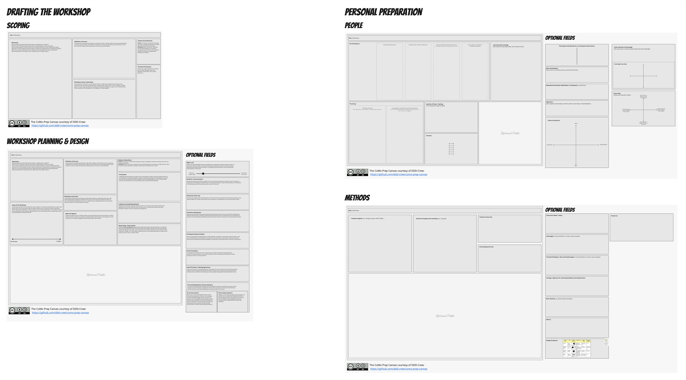

# Collaborative Modelling Workshop Preparation Canvases
The "Collaborative Modelling Workshop Preparation Canvases" are designed to support facilitators when preparing for collaborative modelling (CoMo) workshops. The goal is to improve the overall quality and outcomes of CoMo workshops and to help newcomers to get started.

The canvases are structured into two main areas:
* Drafting the workshop (Scoping, Planning & Design)
* Personal preparation (People, Methods)

> *NOTE* This is a work in progress. Currently, we've provided the canvas as an image that you can copy and paste into your preferred tool.

> We plan to create an official template on Miro in the future. Additionally, you'll be able to extend the canvas yourself in tools like Notion. If you do so, we'd love to see your contributions! Please remember to give credit, as the canvas is licensed under [CC BY-SA](https://creativecommons.org/licenses/by-sa/4.0/).

## Summary
1. [Who are the canvases for](#1-who-are-the-canvases-for)
2. [Overall Structure](#2-overall-structure)
3. [Drafting the Workshop - Scoping](#3-drafting-the-workshop---scoping)
4. [Drafting the Workshop - Workshop Planning \& Design](#4-drafting-the-workshop---workshop-planning--design)
5. [Personal Preparation - People \[WIP\]](#5-personal-preparation---people-wip)
6. [Personal Preparation - Methods \[WIP\]](#6-personal-preparation---methods-wip)
7. [How to use this canvas](#7-how-to-use-this-canvas)

## 1\. Who are the canvases for

The canvases are designed to support everyone facilitating collaborative modelling workshops. However it might provide different value depending on your experience and the the type of workshop:

**Guidance for New Facilitators:** The canvases offer a structured starting point, helping new facilitators understand how to plan and execute a successful workshop. They outline essential considerations when drafting a workshop and help to avoid common pitfalls.

**Tool for Experienced Facilitators:** Seasoned facilitators can use the canvases as checklists to ensure nothing is overlooked in the preparation process, maintaining high-quality standards. The structured approach also promotes a less biased preparation as one is less influenced by recent experiences and can engage with each workshop anew.

Furthermore, they can be used for the following:

**Exploring New Perspectives:** By highlighting potential different aspects, the canvases encourage facilitators to explore new perspectives and reflect on their own facilitation style. It can be used as a diagnostic tool to identify potentially challenging workshop environments and find blind spots in deceptively easy settings. Certain patterns or triggers during the canvas completion process may indicate complexity or difficulties.

**Preparing for Challenging Environments:**
The canvas is designed to help you when facing rather challenging settings. It will guide you through in your preparation and help you to better understand the environment (goal, status quo & people). It will also support you to make your own assumptions transparent to be able to challenge them. By going through the different sections and related questions, the canvas helps you to effectively prepare the workshop’s outline (storyline, communication strategy, shared goal).

## 2\. Overall Structure

### 2.1 Drafting the Workshop
These canvases are designed to guide you in drafting a workshop, whether it's with your team, facilitating it for colleagues within your company, or for clients if you're a consultant. The information you gather using these canvases should first be discussed with the initiator(s). This discussion should then lead to an invitation of the session where all relevant information is shared with all stakeholders, helping to shape the workshop's goals and structure. The canvases include guiding questions for scoping, planning, and designing a CoMo workshop.

#### 2.1.1 Scoping ([3. Drafting the Workshop - Scoping](#3-drafting-the-workshop---scoping))

#### 2.1.2 Workshop Planning & Design ([4. Drafting the Workshop - Workshop Planning & Design](#4-drafting-the-workshop---workshop-planning--design))

### 2.2 Personal Preparation (**Work in Progress**)
These Canvases serve for your own preparation and should stay **with the facilitators (and their close collaborators) only** as they contain hidden agendas, assumptions, personal triggers, alternatives on methods, thoughts behind the storyline, and more. They target the rather invisible aspects that are crucial for a successful workshop preparation are split into **People** and **Methods**. The people canvas is designed to create awareness on motivations and hidden agendas of your stakeholders and how knowledge and power are distributed. The methods canvas contains different sections that help in designing a consistent storyline throught the workshop and to deep dive on the methods used. 

#### 2.2.1 People ([5. Personal Preparation - People](#5-personal-preparation---people-wip))

#### 2.2.2 Methods([6. Personal Preparation - Methods](#6-personal-preparation---methods-wip))

## 3\. Drafting the Workshop - Scoping

Usually the first step when preparing a (collaborative modelling) workshop is discussing its motivation and background (like *what led to the workshop*) as well as the definition of success (like *what should have changed afterwards*). Furthermore, it helps to establish a suitable (working) title early on, discuss initial ideas for the workshop format, and identify the key parties involved (initiator, beneficiaries & potential participants).

### 3.1 Title of Workshop
A clear, concise name for the upcoming collaborative modelling session. 
    
**Why it matters:**  
This title sets expectations and gives the workshop a clear identity from the outset and should be aligned with the goal and scope of the workshop. If you struggle in finding a concise title for the workshop, the goal and scope might not be clear enough yet. Same applies if the title is not understood by stakeholders without further explanation. 

**Examples:**
- "EventStorming Workshop: Improving the Order Fulfilment Process"
- "Re-Discovery Workshop for the Booking Platform"
- "Domain modelling to realign teams"
- "Aligning architecture with a Bytesized Architecture session"

### 3.2 Motivation
This section delves into the "why" behind the workshop. Consider answering the following questions to clarify its purpose:
- What prompted this workshop? What specific situation or challenge led to its initiation?
- What's the current situation or status quo? Describe the existing conditions, systems, or processes.
- How are we/they organised? Outline the team structure, departmental setup, or relevant organisational aspects.
- What does the current architecture look like? Provide an overview of the existing technical or operational architecture.
- What's the current level of DDD (Domain-Driven Design) and CoMo knowledge within the team/organisation?
- What specific problems are we trying to solve or opportunities are we trying to capture?

**Why it matters:**  
It is important that you are clear about the problem you want to solve and the situation your in. Try not to solve too many problems at the same time and pinpoint the challenge you want to tackle in this workshop. The more you know in advance the better you can adapt the workshop format to the needs of the Initiator & beneficiaries. 
  
What's more, getting stakeholders involved in these initial chats can sometimes be super valuable. If you can organise some interviews with some of the stakeholders defined after the initial scoping to improve the motivation. It helps them grasp the problem more fully and deepen their understanding, which is already a huge step toward finding a solution or making things better.
  
**Examples:**
- To identify process bottlenecks in our current order-to-delivery workflow and collaboratively propose improvements. 
- Currently, our average delivery time has increased from 2 days to 5 days in the last quarter.  
- Customer complaints have risen by 40%.  
- Multiple departments (Sales, Warehouse, Shipping) have overlapping responsibilities but lack clear communication.

### 3.3 Definition of Success
Think about what the workshop should achieve—what needs to change or improve. What are the core goals that absolutely must be met by the end of the session? Make sure to frame these as a win-win opportunity for everyone involved. You can also include some objectives that would be great to hit but aren't strictly mandatory.

**Why it matters:**  
A definition of success for a workshop is crucial because it clarifies the objectives, outlining what the workshop aims to achieve. It guides the planning process, helping to design the format and activities to meet specific goals. It also provides a way to measure progress and evaluate the workshop's effectiveness. Ultimately, having a clear definition of success enhances focus, keeping discussions and activities centered on achieving the desired results.
  
It aligns participants by ensuring everyone understands the purpose and expected outcomes, providing a baseline so all enter the workshop on the same page. This should be shared beforehand and at the start of the workshop. Being aware of participants' potential fears and motivations is also beneficial (see more in section [5.2 Participants](#52-participants)).

**Examples:**
- A shared understanding of the "Order Fulfilment" domain and key events and a clear way forward.  
- A prioritised list of bottlenecks and possible interventions.  
- Agreement on next steps to pilot one key improvement.
- A shared understanding between the different departments and everyone pulling in the same direction.

### 3.4 Workshop Format: Initial Ideas
At this stage, there's no need for a concrete agenda. However, it's helpful to start shaping the rough outline of your workshop's format. Think about key elements like the rough time frame, whether that's 1-2 hours, a half-day, or multiple days (1, 2, or even 5 days). You should also consider your initial ideas for methods you might use, such as EventStorming, Domain Storytelling, Context Mapping, User Story Mapping, or Example Mapping.

**Why it matters:**  
Discussing initial ideas on the workshop format early on is important because it shapes the planning process, ensuring the workshop is structured effectively from the start. It aligns expectations among stakeholders, providing a shared understanding of how the workshop will proceed. It helps to identify the necessary resources and to anticipate and address potential challenges.

**Examples:**
- 1-2 hours of Design Level EventStorming
- 1/2 day with Domain Storytelling and Example Mapping
- 5 days with Wardley Mapping, Big Picture EventStorming, Impact Mapping and Bytesized Architecture sessions.

### 3.5 Initiator & Beneficiaries
Initiator is the person or group who first brought up the idea or identified the need for the workshop. They're the ones who got the ball rolling. Beneficiaries refers to the group or individuals who will directly benefit from the workshop's successful outcome. They're the ones who stand to gain from the changes or improvements the workshop aims to achieve.    

**Why it matters:**  
Understanding who brought the workshop to life helps clarify motivations and possible goals. They often provide valuable background information to the status quo and the people involved. They are your lever into the company / department / team, but they might also have their hidden agenda in doing so. Also be clear about who are your beneficiaries, like who actually benefits in the end of the workshop and it's results. Try to find out as much as possible about the beneficiaries throughout the preparation, e.g. fears and individual motivations. But also be aware they might be wrong / it's just one opinion. You can use the Setting the Stage sessions to get more insights yourself.

**Examples:**
- Initiator: Head of Supply Chain Innovation at XYZ Company & Beneficiaries: Operations and Sales Teams
- Initiator: Senior Dev in Team XYZ Beneficiaries: Dev & Product Teams

### 3.6 Potential Participants 
Everyone who might be needed for the workshop (e.g. Tech Leads, Developers, Tester, Sales Department, Product Owner, User, Customer, Operations, ...).
    
**Why it matters:**  
Thinking through who should be in the room for a collaborative modelling session is absolutely essential. Every person, from Developers to Testers, and from Product Owners, Users to Domain Experts, and especially people who can decide brings a unique and vital perspective. Including these diverse viewpoints isn't just about ticking boxes; it's about building a holistic and accurate understanding of the problem or system you're modelling. When everyone contributes, you not only uncover hidden insights and potential pitfalls early but also foster a shared understanding and stronger buy-in, ultimately leading to more robust solutions and successful outcomes.

**Examples:**
- Software developers
- Testers
- Product Managers
- User researchers
- Business Analysts
- Agile Coaches
- Managers
- Users
- Ops Engineers
- ... and all the roles involved and invented in your company in building the software

## 4\. Drafting the Workshop - Workshop Planning & Design

When actually planning and designing the workshop it probably helps to further refine and extend the already gathered information of the Scoping Canvas (in case it was used before, else check out [3. Drafting the Workshop - Scoping](#3-drafting-the-workshop---scoping)). Aditionally there is more information that should be considered which are part of the Workshop Planning & Design Canvas. It also contains optional fields that can be added depending on the format, context and experience of the facilitator(s). The goal is to have all information ready that you need to share with the workshop participants and stakeholders in advance. It should also contain everything you might need to actually design the workshop (e.g. with the [6. Personal Preparation - Methods Canvas](#6-personal-preparation---methods-wip)). 

This canvas contains "default" as well as "optional" fields. The default fields can be considered a recommendation that should fit every workshop setting but can, of course, be adapted depending on the scope and requirements of the workshop. The optional fields contain an (incomplete) list of possible additions and deep dives that might bring useful insights depending on the situation.

### 4.1 Scope of the Workshop
Understanding what falls within and outside the scope is essential. This includes considering products, domains, value streams, teams, services, and systems. Reflect on whether decisions need to be made and consider incorporating decision-making styles (see optional field). Additionally, it may be the right moment to discuss the flight level, such as whether you want to focus on the domain, business processes, application flow or actual code (consider adding the optional field for deeper exploration). Being as specific as possible helps minimize misunderstandings and unexpected surprises. 

**Why it matters:**  
Addressing the scope of the workshop beforehand helps to better understand the problem and determine whom you need for your workshop to be successful. It sets expectations and enables the participants to prepare respectively. Being aware of what is in and out of scope helps to keep the workshop focused and ensures that discussions remain productive. Sometimes it is easier to pinpoint what is out of scope than in scope. By asking for both, you can more easily sense and react to any resistance or conflict in the group and adapt to your stakeholder group, opening up new perspectives.

It also helps find the right methods for the workshop and manage expectations (e.g., what is possible vs. what would be wished for in an ideal world). It helps facilitators prioritize if time is limited. If time remains, you can address these. Sometimes it's easier for stakeholders to deprioritize their expectations rather than skip them completely. They can also serve as potential follow-ups after the workshop. 

**Example:**
- Order submission (Sales & Operation Departments) - Strategic Alignment
- Inventory checks - Software Design level 
- Payment processing is out of scope as it is handled separately by Finance
- Customer support ticketing are out of scope as it is handled by Customer Service after delivery
- Provide a decisions-making basis for the leadership team
- Decide on a migration strategy
- Identify the Re-Discovery Scope for the legacy migration
- We're not taking decisions but just discovering

### 4.2 Workshop Constraints
Consider what could go wrong in achieving your workshop goal and how you might address these issues. Think about potential backup participants you might be able to invite on short notice. Ensure having more than one person with dedicated knowledge from each team or stakeholder group. Identify subgoals that could still provide value and consider how to stretch deadlines if necessary.

**Why it matters:**  
It's important to take a moment for a more cautious perspective to prepare for potential challenges. By anticipating obstacles, you can develop contingency plans, ensuring the workshop remains productive and valuable even if not everything goes as planned. This approach fosters resilience and adaptability.

**Example:**
- Important people not showing up
- Hard deadlines that need to be met
- No backing from the management
- Decisions cannot be made
- Crucial knowledge is lacking / missing

### 4.3 High Level Agenda    
Outline the workshop structure, including methods used, expected timings, breaks, and start/end times. Provide a high-level schedule or timeline, and consider incorporating subgoals. Also decide how much information to share in advance, as it can influence engagement and the overall success of the workshop.

**Why it matters:**  
Providing participants with a clear understanding of what to expect enables them to prepare effectively and manage surrounding commitments, such as conflicting meetings, workloads, and personal obligations. While detailing every method isn't necessary, sharing the overall storyline and explaining the rationale behind chosen methods fosters trust and confidence in you as the facilitator, showcasing your well-thought-out plan. Additionally, this helps identify other organisational needs, such as food, coffee, room setup and meeting points.

**Example:**

**9:00 – 9:30** Check-In & Intro 
**9:30 – 10:30** EventStorming  
**10:30 – 10:45** Coffee Break (there is a coffee machine on the second floor)
**10:45 – 12:00** Identifying bottlenecks & potential improvements  
**12:00 – 12:30** Discussion of next steps and wrap-up
**12:30 - 13:30** Lunch together (Max will reserve a table at a nearby restaurant)

### 4.4 Participants
To effectively plan the workshop, you'll need a clear list of participants. Include not only those seeking solutions but also individuals with specialized knowledge or expertise. Consider potential questions and identify who can provide answers. Ensure you have decision-makers available if needed. Sharing knowledge is crucial, so consider having more than one representative from each stakeholder group to spread information effectively.

**Why it matters:**  
Knowing whom to invite is essential because it ensures that the workshop is productive and effective. The right participants bring the necessary expertise and perspectives, enabling comprehensive discussions and informed decision-making. It also helps balance the group with both questioners and experts, preventing the facilitator from becoming the sole source of inquiry. This strategic selection enhances collaboration, ensures all relevant issues are addressed, and maximizes the workshop's impact by involving those who can drive outcomes and implement changes.

**Example:**
- Jessica (Senior Warehouse Manager)  
- Dan (New IT Project Lead)  
- Peter, Sandra, Alex & Laura (Dev Team)
- Mario (Shipping Specialist, been here for the last 15 years)
- Rhea (Business Analyst, joined only a couple of months ago)
- Two people form the financial department (they will figure out who will join within the team)

### 4.5 Collaborative Modelling Methods
Identify which collaborative modelling methods you plan to use. Consider how these methods will impact the agenda and the room setup. Determine if there are any resources or materials that should be shared with participants in advance to enhance preparation and engagement.

**Why it matters:**  
The choice of modelling methods directly influences the workshop's structure and effectiveness. Different methods may require specific room layouts, tools, or materials, impacting logistics and planning. Sharing resources beforehand ensures participants are well-prepared, facilitating a smoother and more productive session. Additionally, the right methods foster engagement and collaboration, leading to more meaningful outcomes.

**Example:**
- EventStorming – Room with a long wall and many sticky notes
- Domain Storytelling & Wardley Mapping – Whiteboard and big screen
- User Story Mapping – Sticky notes and printed screen designs
- Impact Mapping – Flip charts/whiteboard, sticky notes, and markers
- Context Mapping in small groups – Round tables, flip charts, and sticky notes
- Example Mapping in group of 4-5 - Tables with different colours index cards, sharpies.

### 4.6 Room Setup / Tools Needed
Identify the tools and equipment needed for the workshop and determine who will provide them. Consider if the room needs to be prepared in advance (if onsite) and when that's possible. Think about the room setup, including seating, walls, flipcharts, and stickies, to ensure the layout accommodates collaborative activities and all necessary materials are available. For a virtual setting, consider what tools to use and what preparations are needed, such as setting up break-out rooms or organizer rights.

**Why it matters:**  
Proper room setup and the availability of tools are crucial for a seamless workshop experience. The right environment enhances participant engagement, supports the chosen collaborative methods, and minimizes disruptions. Being well-prepared ensures that the workshop runs smoothly and that participants can focus on the content rather than logistical issues.

**Example:**
- Arrange seating in clusters for small group discussions.
- Ensure a projector and screen are set up for presentations.
- Provide sticky notes, markers, and flip charts for brainstorming sessions.
- Confirm Wi-Fi access for participants.

### 4.7 Optional Fields
The following sections contain an (incomplete) list of possible additions and deep dives that might bring useful insights depending on the situation. Be aware to not over complicate the canvas (premature optimasation) but only add the fields that acutally provide value to your workshop.

#### Flight level
Decide on the appropriate flight level for the modelling session, ranging from a high-level strategic overview to a fine-grained, action-oriented plan. The flight level determines the level of detail and the scope of the discussion, influencing the techniques and tools you will use. A clear flight level ensures everyone is on the same page and working towards a common goal.

**Why it matters:**  
The flight level helps you manage expectations and keeps the workshop focused. If participants have different ideas about the level of detail, it can lead to confusion and unproductive discussions. By aligning on a specific flight level, you can tailor the workshop to the participants' needs and ensure the outcomes are relevant. It also helps to determine which stakeholders to invite, ensuring the right people are in the room to make the necessary decisions and contributions.

**Example:**
- Strategic: High-level overview of the entire value stream, focusing on business processes and dependencies between different departments.
- Tactical: Analyzing a specific business process, such as order fulfilment, to identify bottlenecks and opportunities for improvement.
- Code-level: Diving into the technical implementation of a microservice to identify areas for refactoring or to understand its dependencies on other services.
- Product-level: Focusing on a single product or service to define its features and user journey.

#### Artifacts / Documentation
Consider what kind of documentation or artifacts you want to create during and after the workshop. These can range from a simple photo of the whiteboard to a detailed report or a working code prototype. The type of documentation you create depends on the workshop's goal and the audience you want to share the results with.

**Why it matters:**  
Documentation is crucial for preserving the workshop's outcomes and ensuring the decisions and insights gained are not lost. It serves as a single source of truth, allowing participants to refer back to it and share it with others who couldn't attend. It also helps with the follow-up, ensuring everyone knows what needs to be done next. By deciding on the artifacts in advance, you can set expectaions, prepare the necessary tools and ensure someone is responsible for creating them.

**Example:**
- A photo of the whiteboard with all the sticky notes and drawings.
- A digital copy of the model created in a collaboration tool like Miro or Mural.
- A written summary of the workshop's key findings, decisions, and next steps.
- A detailed report with diagrams, user stories, and a plan for implementation.
- A backlog of user stories created during the session.

#### Potential Follow-up
Think about what happens after the workshop ends. The outcomes of the session should not be the end of the journey but a step towards a bigger goal. Consider what next steps need to be taken, who is responsible for them, and how they will be tracked.

**Why it matters:**  
A workshop is only as valuable as the actions that follow it. By thinking about the follow-up in advance, you ensure the momentum is not lost and the outcomes are put into practice. It helps participants understand that their contributions matter and that their work will lead to tangible results. It also helps to set realistic expectations and prevents the workshop from becoming a one-off event with no lasting impact.

**Example:**
- A follow-up meeting to present the workshop results to the leadership team.
- A second workshop to dive deeper into a specific area identified as a bottleneck.
- A presentation to other teams to share the knowledge and decisions gained.
- A project plan based on the outcomes of the session.
- Individual tasks for participants to take on.

#### Decision-making style
Decide how decisions will be made during the workshop and which decisions need to be made. The decision-making style can range from autocratic with a command or proposal to democratic given an idea or just the problem. It is important to be clear about it from the beginning. Additionally, be specific about which decisions can and need to be made during the workshop and which can / will **not** be taken. In case decisions need to be taken check if you have the right people in the workshop.

**Why it matters:**  
Decision-making is a critical part of any collaborative session. Without a clear style, discussions can go on forever, leading to frustration, conflicts, resistance and a lack of progress. By setting the ground rules in advance, you ensure the workshop remains productive and on track. It also helps to manage expectations and empowers participants to contribute effectively, knowing how their input will be used.

**Example:**
- Autocratic: A single person makes the final call.
  - Command: A project manager hears everyone's input before making the final decision.
  - Proposal: An architect gathers input and proposes a decision, which can only be overturned if a significant risk is identified by the team.
- Democratic: A decision is reached through a vote, with the majority winning.
  - Idea: The Product Owner presents a problem and an idea for a solution. The group then votes, and the majority decision is accepted, with minority needs being considered.
  - Problem: The group is presented with a problem and votes on a solution. The majority decision is accepted, with minority needs being considered.
- Consensus: The group discusses an issue until everyone agrees on a solution.
- Consultative: The team provides input, but the final decision is made by a designated leader, like a tech lead.
- Decisions to be made:
  - Which component should be refactored first?
  - What is the priority of the user stories?
  - Should we use this technology or that one?
- Decisions not to be made:
  - Changing the project's overall budget or deadline.
  - Changing team structure

#### Participants (Names & Roles)
A clear list of participants is fundamental for a successful workshop. It sometimes is not enough to simply list names; you also want to understand their roles and why they are being invited. The participant list should include not only those who need a solution but also individuals with specialized knowledge or expertise and, crucially, anyone with the authority to make decisions (in case they need to be taken). 

*This section is an extension of [4.4 Participants](#44-participants) and can be used as replacement if needed*

**Why it matters:**  
Knowing who is in the room can be critical because it ensures you have the right mix of perspectives and knowledge to address the problem effectively. A well-curated participant list balances the group with both questioners and experts, which prevents the facilitator from becoming the sole source of inquiry. This strategic selection enhances collaboration, ensures all relevant issues are addressed, and maximizes the workshop's impact by involving those who can drive outcomes and implement changes. Having a clear list also makes it easier to communicate with participants and manage logistics.

**Example:**
- Jessica (Senior Warehouse Manager): Provides critical domain knowledge on current inventory processes and operational constraints.
- Dan (New IT Project Lead): Represents the technical team and has authority over resource allocation for a new software solution.
- Peter, Sandra, Ming & Laura (Dev Team): The people who will build the solution and have the on-the-ground technical expertise.
- Shanice (Shipping Specialist, 15 years experience): A long-time employee whose deep knowledge of historical issues and workarounds is invaluable.
- Rhea (Business Analyst, joined 3 months ago): Brings a fresh, objective perspective and can ask the naive questions that uncover hidden assumptions.
- Two people from the financial department: This leaves the decision of who will attend up to that department, ensuring the most relevant people can be there, while still making it clear they are a necessary stakeholder group.

#### Food & Socializing
For workshops that last a full day or more an opportunity you should plan for food and opportunities to socialize. This includes deciding on meals, snacks, and drinks, as well as social activities that can help participants connect on a more personal level. 

**Why it matters:**  
Workshops, especially multi-day ones, can be mentally draining. Providing quality food and breaks helps to sustain participants' energy and focus. Furthermore, shared meals and social activities outside of the formal workshop structure create an informal environment where participants can build trust and rapport. These conversations often lead to breakthroughs and a deeper understanding of one another, which can be invaluable for the collaborative work being done. Just be sure that for a lot of people social activities added to the already social draining sessions can be a burden, so be sure to check everyone's need!

**Example:**
- Meals: Arranging for a catered lunch on-site to keep the flow going, or booking a table at a nearby restaurant for participants to connect over a shared meal.
- Breaks: Providing a continuous supply of coffee, tea, and snacks throughout the day, and scheduling short, intentional breaks to prevent burnout.
- Social Activity: Planning a team dinner or an informal after-hours activity (e.g., a group walk, a pub visit, Bowling) on the first day to help everyone relax and get to know each other.

#### Code of Conduct / Working Agreement
Create a code of conduct or working agreement for the workshop. This can be a simple list of rules that everyone agrees to follow to ensure a productive and respectful environment. It helps to set the tone and ensure everyone feels safe to contribute. Be sure to validate it at the start of your session if everyone's agreeing with it and if there need to be more.

**Why it matters:**  
A code of conduct provides a framework for how participants should interact with each other. It helps to prevent conflicts and ensures that everyone's voice is heard. By co-creating the rules, participants feel a sense of ownership and are more likely to follow them. It also helps the facilitator to intervene if a situation becomes unproductive or disrespectful.

**Example:**
- Nobody hold the monopoly to the truth, we listen to the 'no'
- Respect others' opinions: Even if you disagree, listen to what they have to say.
- Timeboxing: Stick to the allocated time for each activity.
- No laptops/phones: Be present and focused on the task at hand.
- One conversation at a time: Avoid sidebar conversations to ensure everyone can hear.
- "Vegas Rule": What is said in the room, stays in the room.
- "Parking Lot": Use a parking lot for discussions that are out of scope.

#### Overcoming Resistance & Securing Buy-In
It's common for participants and stakeholders not to immediately see the value of a workshop. This section is about planning non-coercive techniques to engage them and earn their commitment. It involves proactively addressing potential resistance and ensuring that key people are genuinely bought into the process.

**Why it matters:**  
Without buy-in, even the best-designed workshop can fail. Participants who feel forced to be there or don't understand the purpose will likely disengage, and their resistance can spread to others. By anticipating this and planning to address it with non-coercive methods, you create a more positive and productive environment. This proactive approach builds trust, respects people's time, and ensures that the workshop's outcomes have a much better chance of being implemented.

#### Do we have buy-in?
This is a critical, self-reflective question to ask during the planning phase. It involves assessing whether the key participants and decision-makers genuinely believe in the value of the workshop's goals. This isn't just about them saying "yes," but about understanding if they are willing to invest their time and energy.

**Example:**
- Assessing Buy-in:
  - Have the project sponsor and key leaders publicly endorsed the workshop?
  - Have the participants themselves expressed interest or helped shape the agenda?
  - Is there a clear, shared understanding of what success looks like?
- Actions to secure buy-in:
  - Having one-on-one conversations with reluctant participants beforehand to understand their concerns.
  - Involving a key stakeholder in the planning to co-design the agenda.
  - Clearly articulating the "what's in it for me?" for each participant.

#### Overcoming Resistance
Resistance is a normal part of change. Instead of seeing it as a problem, view it as a signal that something important has been overlooked, what has to be said that has not been said yet? This subsection is about identifying the sources of potential resistance and planning how to address them respectfully.

**Example:**
- Identifying Resistance:
  - Source: "We've tried this before, and it didn't work."
  - Technique: Acknowledge their past experience. "You're right, that's a fair point. What was different last time, and what can we do to ensure this is a success?"
  - Source: "This is a waste of time. I have real work to do."
  - Technique: Connect the workshop's goal directly to their "real work." "I understand your time is valuable. The goal of this workshop is to fix the bottleneck that's causing X, which should save you time in the long run."
  - Source: "I don't trust the outcome will actually be implemented."
  - Technique: Be transparent about the follow-up plan. "That's a very important point. At the end of the workshop, we'll decide on concrete next steps, and we'll track those actions as a group."

## 5\. Personal Preparation - People [WIP]

Workshops don’t happen in neutral space. They’re shaped by the people in the room, their motivations, roles, and personal experiences. While goals, formats, and logistics are visible at the surface, most of what influences collaboration sits below it: assumptions, behavioural patterns, personal triggers, power dynamics, and implicit expectations. Ignoring this layer doesn’t make it disappear; it usually resurfaces later as tension, silence, or resistance.

The People Canvas helps you prepare for these deeper dynamics. It’s not about fixing people but about recognising patterns, anticipating reactions, and designing conditions where different perspectives can contribute safely and productively. It’s also about making your observations, assumptions, and biases explicit and tangible. 

Understanding what lies below the surface makes facilitation more resilient. It helps you address potential issues before the workshop by adapting your methods, moderation style, participant mix, room setup, or communication strategy, for example through additional scoping rounds or setting-the-stage sessions with different stakeholder groups.

### 5.1 The Participants 
Understanding who participates in a workshop is more than collecting names. Each participant brings roles, motivations, assumptions, and behavioural patterns that influence how the session unfolds. Preparing for these factors helps you anticipate friction, align expectations, and create conditions for productive collaboration. Think about grouping / sorting the participants by teams, roles, experience or rank to have a better overview.

#### 5.1.1 Role(s)
Identify the various roles participants hold, noting that some individuals may have multiple roles. Consider which perspectives are essential for the workshop's success.

**Why it matters:**  
Roles shape influence, perspectives, and how decisions are perceived. Each role brings its own perspectives, knowledge, and priorities. Knowing who is responsible for which area, their formal power, and whether they are internal or external allows you to design activities that account for authority, access to information, and potential gaps in perspective. Being aware of these roles helps you tailor discussions to be relevant and productive, ensuring all viewpoints are considered. For example, a Team Lead may prioritize departmental goals, while a Software Engineer focuses on technical feasibility. Recognizing these differences allows you to anticipate potential conflicts, align objectives, and foster collaboration among diverse participants. This awareness supports more balanced and effective outcomes.

**Example:**  
- Team Lead
- QA / Tester
- Architect
- Sales Manager
- Key Accountant
- Software Engineer
- Product Owner

#### 5.1.2 Individual Goals / Benefits / Motivations
Participants bring personal objectives and expectations to the workshop. These can range from solving technical problems to gaining visibility, validating assumptions, or protecting processes. Try to recognize and understand the personal or departmental goals and determine what benefits the participants hope to gain from the workshop.

**Why it matters:**  
Explicitly understanding individual goals helps anticipate alignment or conflict and ensures the session addresses both collective and personal outcomes. Misaligned goals can create tension, disengagement, or hidden resistance. Recognising motivations also allows you to frame activities and discussions so that participants see value in contributing.

**Example:**  
- Better career advancement opportunities
- Less work for the team
- Option to work on new (cool) features
- Supporting others
- Fear of losing their job
- Desire to validate a technical decision or assumption
- Protecting a process or deliverable
- Learning, visibility, or influence within the organisation

#### 5.1.3 Behavioural Patterns
A Behavioural Pattern for a participant is a consistent (at least 3x observed), observable action or dynamic brought by a participants that (might) influence the interaction or the modelling process.

Following the principles of behaviorism, we focus on observable actions: what an organism does, or what another organism observes it doing. We want to identify these repeatable actions that are constantly influencing the collaboration.

**Why it matters:**  
Since behavior is observable, facilitators can proactively forecast, manage, and mediate these patterns. Identifying and documenting observable dynamics—that can be categorised as habitual resistance, subconscious agendas, or recurring interpersonal friction—allows the facilitator to prepare by designing specific interventions. Structuring the workshop to safely manage or surface this observed tension and redirecting energy productively prevents the behavior from derailing collaboration and outcome of a session.

**Example:**  
- Consistent Agreement/Disagreement Pairs: The observable action is Person A always supporting/opposing Person B.
- Silent Observers: The observable action is consistent non-verbal cues or hesitation before inputs.
- Talking over each other: Someone consistently does not let someone finish their sentances.

#### 5.1.4 Your thoughts / assumptions / personal risks & biases
This step requires the facilitator to separate objective observation from subjective interpretation. When observing a participant's behavior, we often instinctively jump up the Ladder of Inference—adding meaning, making assumptions about their motive, and forming conclusions.

Your task is to explicitly capture any assumptions, emotional responses, or biases (e.g., preference for one team, shared history with a participant, cognitive shortcuts like confirmation bias) that you bring into the session, based on your preparation and initial observations.

**Why it matters:**
Facilitator bias is a significant personal risk to the session's success. When your assumptions are not checked, they can lead to:

- Misjudged Interventions: You challenge a "resistant" person who was simply confused.
- Confirmation Bias: You only hear evidence that supports your existing belief about a person or team.
- Compromised Impartiality: Participants sense your favoritism or impatience, eroding trust and psychological safety.

Explicit self-reflection allows you to create neutral interventions that address the observed behavior rather than the assumed motive, ensuring your actions are impartial and productive.

**Examples:**

|

| Observation (Objective Fact) | Assumption (Your Subjective Interpretation/Emotion) | Facilitator Risk (Bias-Driven Action) |
|--|--|--|
| Participant A sighed and crossed their arms twice during the introduction. | They are resistant, passive-aggressive, and don't want to be here. | Risk: You ignore A's later, valid critical inputs because you've pre-labeled them as disruptive. |
| Participant B (from Team X) enthusiastically agrees with every point made by Participant C (from Team Y). | Team X is being overly friendly and trying to please Team Y, they must have a hidden political agenda. | Risk: You challenge B unnecessarily, forcing them to defend their agreement and damaging cross-team rapport. |
| Participant D, who holds a junior role, hasn't spoken in 45 minutes and is quiet. | They have nothing valuable to add, or they are just too shy and lack confidence. | Risk: You miss crucial, detailed operational information that only D possesses, because you failed to directly invite their perspective. |

### 5.2 The Group

#### 5.2.1 Behavioural Patterns
A Behavioural Pattern for the group is a consistent (at least 3x observed), observable action or dynamic brought by at least 3 different participants that (might) influence the interaction or the modelling process.

Following the principles of behaviorism, we focus on observable actions: what an organism does, or what another organism observes it doing. We want to identify these repeatable actions within the group, because if one participant is showing a behaviour we do not want to address that in the group, only when the patterns is part of the group do we want to address is so we can try to not make it derail th collaboration and outcome of a session.

**Why it matters:**  
Since behavior is observable, facilitators can proactively forecast, manage, and mediate these patterns. Identifying and documenting observable dynamics—that can be categorised as habitual resistance, subconscious agendas, or recurring interpersonal friction—allows the facilitator to prepare by designing specific interventions. Structuring the workshop to safely surface this observed tension and redirecting energy productively prevents the behavior from derailing collaboration and outcome of a session.

**Example:**  
- Collective Inertia/Aversion: The observable action is the quick rejection or excessive challenge of new, complex, or change-inducing ideas by three or more individuals.
- Shared Deference/Gatekeeping: The observable action is three or more participants looking to, waiting for, or agreeing with a specific high-status individual before offering their own opinions.
- Topic Avoidance: The observable action is three or more participants jointly and quickly steering the conversation away from a difficult, sensitive, or high-conflict topic when it is raised.

#### 5.2.2 Your thoughts / assumptions / personal risks & biases
See 5.2.1

### 5.3 Polarities
Polarities are interdependent pairs of opposing values or needs that are both necessary for success. Unlike problems that can be solved, polarities must be managed—choosing one side over the other creates new problems. Common workshop polarities include speed vs. quality, innovation vs. stability, or central control vs. autonomy.

**Why it matters:**  
Unrecognized polarities appear as recurring conflicts where one side temporarily "wins" only for the problem to resurface. Explicitly naming polarities allows you to validate both perspectives, design activities that explore both poles, and help the group navigate the tension productively rather than forcing an either/or choice.

**Examples:**  
- **Standardisation vs. Flexibility**: Operations needs consistency; innovation needs experimentation. Both necessary.
- **Speed vs. Quality**: Product pushes for rapid delivery; engineering emphasises thorough testing.
- **Central Coordination vs. Team Autonomy**: Leadership wants alignment; teams want independence.
- **Big Picture vs. Details**: Strategists focus on vision; implementers need concrete specifics.
- **Divergence vs. Convergence**: Some want to explore options; others want to decide and move forward.

### 5.4 Symbols of Power / Ranking
Symbols of power are markers—visible or invisible—that signal authority, status, and influence within the group. These include formal rank (titles, reporting lines), informal capital (tenure, expertise, relationships), and contextual power (who controls resources, information, or decisions). Power dynamics shape who speaks, who is heard, and whose ideas are validated.

**Why it matters:**  
Unaddressed power imbalances silently shape outcomes. High-status participants may dominate while lower-status participants self-censor. Critical information gets lost when people don't feel safe to share. By recognizing power dynamics, you can design activities that level the playing field (silent brainstorming, round-robin sharing, anonymous input) and adjust facilitation to protect psychological safety.

**Examples:**  
- **Formal Hierarchy**: VP in the room with junior developers—developers may hesitate to challenge decisions.
- **Tenure**: Long-serving employees carry informal authority; newer employees defer even when fresh perspectives are valuable.
- **Technical Expertise**: The recognised expert's opinions are weighted more heavily, potentially silencing alternatives.
- **Budget Control**: Whoever controls funding holds power; others may self-censor proposals they fear won't be resourced.
- **External vs. Internal**: External consultants may have more credibility than internal staff saying the same thing.
- **Language & Communication**: Native speakers or extroverts dominate; others take longer to formulate responses. Silent observers in the back can be perceived as holding ultimate decision power.
- **Gender or Social Background**: Traditional biases still operate—voices fitting stereotypical "leadership" patterns are heard first.
- **Clothing Style**: A suit vs. a hoodie signals different things in different contexts (techie vs. sales).

### 5.5 Communication Strategy
A comprehensive communication strategy is crucial for workshop success. It involves planning how you, as the facilitator, will engage with participants and stakeholders at every stage—before, during, and after the workshop. Determine when, who, and what you will communicate. Establish timelines for updates and clarify the roles of participants and stakeholders. Decide on the most effective methods for communication, such as email for detailed information, Slack for real-time interactions, and in-person meetings for more nuanced discussions.

**Why it matters:**  
Effective communication keeps everyone aligned, manages expectations, and ensures no one feels left out. It's essential to engage participants and motivate them for the workshop. In some cases, higher management may require prior check-ins to feel comfortable and well informed.

**Example:**
- Setting-the-stage sessions with all participants before the workshop
- Short Kick-Off Meeting with all stakeholders before the workshop series
- Pre-workshop questionnaire via email
- Slack channel for asynchronous communication and Q&A
- Post-workshop summary circulated to all participants and sponsors

### 5.6 Optional Fields

The following sections contain an (incomplete) list of possible additions and deep dives that might bring useful insights depending on the situation. Be aware to not over complicate the canvas (premature optimasation) but only add the fields that acutally provide value to your workshop.

#### Princial, Initiator & Beneficiaries
**Principal** is the person or group who authorizes and funds the workshop. Their approval and support are essential for the workshop’s success.
**Initiator** is the person or group who first brought up the idea or identified the need for the workshop. They're the ones who got the ball rolling.
**Beneficiaries** refers to the group or individuals who will directly benefit from the workshop's successful outcome. They're the ones who stand to gain from the changes or improvements the workshop aims to achieve.

**Why it matters:**  
Being aware of these roles is crucial for aligning the workshop’s objectives with the broader organisational goals. Understanding who the principal, initiator, and beneficiaries are helps ensure that the workshop addresses the right needs and delivers value to the intended stakeholders.

**Example:**  
- The principal may be a senior executive who provides funding, the initiator could be a project manager driving the workshop, and the beneficiaries might be the teams who will implement the solutions discussed.

## 6\. Personal Preparation - Methods [WIP]

### 6.1 Facilitator Agenda
Your private, detailed schedule for the workshop, including timings for each activity, planned breaks, and meals. It helps you keep track of logistics and stay on schedule, even if the public agenda is more high-level. Include all facilitator-only activities and transitions.

**Why it matters:**
Planning your own time management helps you anticipate transitions, energy dips, logistical needs, and handovers (e.g. to co-facilitators). It prevents running out of time for key activities, highlights where to compress or stretch, and ensures you have a backup plan for overruns or delays (e.g. "drop optional exercise X if we lose >15 min before lunch").

**Examples:**
- Start/end times for each session
- Timing for breaks, lunch, and transitions
- Buffer blocks (e.g. 10 min after complex activity for regrouping)
- Drop/Swap rules (what gets removed first if behind time)
- Notes on setup/cleanup or facilitator-only activities
- Handovers ("Kenny leads Domain Storytelling debrief")

### 6.2 Storyline throughout the workshop
The logical flow of the workshop, showing how each activity connects to the next and how subgoals build toward the main objective. It helps you maintain coherence and momentum and ensures the workshop has a clear narrative ("from divergence to convergence").

**Why it matters:**
Clarifying the storyline ensures each segment has a purpose and participants understand how their work fits into the bigger picture. It prevents a collection of disconnected activities and supports re-orientation after breaks or energy dips. This is especially valuable for complex or multi-day workshops and when stakeholders occasionally join mid-stream.

**Examples:**
- EventStorming (Get the big picture and the main activities as subdomains), User Story Map (Use the found subdomians as entry point for your user story map), Magic Estimation (Use the User Story Candidates to get a high level estimation for the project / feature)
- Wardley Map (Start with user needs, the capabilities needed to adress them and evolution stages), Domain Decomposition (Decompose capabilities into domains, mind high cohesion and loose coupling), Team Topologies (Map team topologies on the domains and mind the team interaction modes for fast flow)

### 6.3 Check-in & Check-out
Structured moments at the start and end of the workshop (and optionally between major phases) to set the tone, surface expectations, and close the session. Check-ins help participants arrive mentally and emotionally; check-outs provide closure, reflection, and commitment to follow-ups.

**Why it matters:**
Check-ins foster psychological safety, build rapport, and ensure everyone is present and engaged. They reduce silent resistance and help you sense energy early. Check-outs consolidate learning, anchor decisions, and prevent a fuzzy end. Mid-phase micro check-ins recalibrate focus after intense divergence.

**Examples:**
- Opening prompt: What’s one thing you need from today to call it worthwhile?
- Mood line (participants place dot on an energy axis)
- Mid-day pulse: 3-word check-in on stickies
- Closing round: One insight + one next step you’ll support
- Silent written reflection: Share one highlight
- Check-out heatmap (confidence in chosen improvement 1–5)

### 6.4 Sense-making Exercises
Activities designed to help participants interpret information, reflect on insights, and connect dots during the workshop. Used after major activities or when the group needs to synthesize findings and align on meaning before moving forward.

**Why it matters:**
Sense-making prevents misunderstandings, supports shared understanding, and enables the group to move forward with clarity. It converts raw output into shared insight, surfaces divergence early, and reduces premature solution picking. Crucial in domains with high complexity or ambiguity.

**Examples:**
- Spectrum line-up: Standard Product vs Custom Build (participants physically position themselves)
- Corner voting on current architecture: Big Ball of Mud / Microservices / Monolith / Distributed Monolith
- Red/Green dots: risk vs opportunity perception on emerging model areas

### 6.5 Optional Fields
This section offers an incomplete list of additional fields and deep dives you can use to tailor your workshop preparation. These are not mandatory—choose only those that add real value for your context. Use them to address specific challenges, enrich your facilitation, or document important details that might otherwise be overlooked.

#### Interaction Modes / Facilitation Techniques
List and describe the facilitation techniques and interaction modes you plan to use, such as silent brainstorming, round-robin sharing, breakout groups, or energizers. Explain how each technique will be applied in your workshop.

**Why/When it matters:**
Proactively planning interaction modes helps maintain engagement, adapt to group energy, and ensure all voices are heard. This is especially important for longer workshops or when you anticipate dips in energy or participation.

**Examples:**
- Use "1-2-4-All" for idea generation to ensure all voices are heard.
- Employ timeboxing and visual timers to keep activities on track.
- Plan breakout groups for deep dives on specific topics.

#### Advantages of Used Methods for Context, Scope, and Goals
Summarize why you selected each collaborative modelling method and highlight the strengths of each in relation to your workshop’s context, scope, and goals.

**Why/When it matters:**
Clarifying your rationale helps you leverage each method’s strong points and communicate your choices to participants or co-facilitators. This is especially useful when you need buy-in or want to adapt your approach for different audiences.

**Examples:**
- EventStorming: Great for quickly visualizing an end-to-end process, identifying bottlenecks, and engaging non-technical people.
- Domain Storytelling: Excellent for clarifying roles and interactions in complex processes.

#### Potential Blindspots, Risks, and Disadvantages of Used Methods
Identify and reflect on the limitations, risks, or common pitfalls of your chosen methods. Include notes on when these issues typically arise and how they might impact your workshop.

**Why/When it matters:**
Anticipating risks allows you to prepare mitigations and adapt on the spot if needed. This is especially important for new methods, large groups, or unfamiliar domains.

**Examples:**
- EventStorming can become chaotic if too many participants talk at once.
- Domain Storytelling can be time-intensive if the domain is very large.

#### Strategy / Approach for Addressing Blindspots and Disadvantages
Describe your concrete plan for handling the risks and limitations you’ve identified. Include specific mitigation steps, alternative activities, or facilitation moves you’ll use if challenges arise.

**Why/When it matters:**
Having a clear strategy equips you with a backup plan so you can confidently guide discussions and adapt as needed. This is especially useful for complex or high-stakes workshops.

**Examples:**
- Pre-divide the domain into manageable slices to avoid analysis paralysis.
- Assign a co-facilitator to manage group discussions and timeboxes.

#### Back Channels
Note any informal communication channels you’ll use during the workshop, such as Slack, WhatsApp, or private messages. Explain their purpose and how they’ll be used for facilitator coordination or participant support.

**Why/When it matters:**
Back channels are useful for real-time coordination with co-facilitators, troubleshooting, or providing participants with a way to ask questions privately. They are especially valuable for hybrid or remote workshops.

**Examples:**
- Slack channel for facilitator coordination.
- WhatsApp group for urgent troubleshooting.
- Private messages for participant questions.

#### Metrics
Define any metrics or indicators you’ll use to measure workshop success, participant engagement, or learning outcomes. Explain how and when you’ll collect data and what you’ll do with the results.

**Why/When it matters:**
Metrics help you assess effectiveness, report results, and improve future workshops. They are especially valuable for recurring sessions or when you need to demonstrate value to stakeholders.

**Examples:**
- Number of ideas generated per session.
- Participant feedback scores from post-workshop survey.
- Engagement rate during group activities.

#### Design Storyboard (from [Liberating Structures](https://www.liberatingstructures.com/21-design-storyboards/))
A Design Storyboard is a deliberately sequenced flow of Liberating Structures (and complementary methods) chosen to serve the specific purpose, participants, constraints, and desired trajectory of a workshop or meeting. It lets you prototype the arc of divergence and convergence, balance energy patterns, and ensure each activity harvests something needed for the next. Instead of an improvised list of methods, the storyboard is a visual/structured map that exposes gaps (e.g. too much idea generation, not enough sense-making) before you are in the room.

**Why/When it matters:**
Design storyboarding makes the workshop flow intentional by explicitly linking each activity’s output to the next, balancing divergence (opening options) with convergence (making meaning and decisions), and helping you anticipate energy dips so you can place movement or reflection at the right moments. It lets you spot gaps (for example, jumping to decisions without a synthesis step) before you are in the room and prepare the harvest (photos, boards, notes) so follow‑up is frictionless.

**Example:**
| Segment | Purpose | Structure (LS / Method) | Harvest / Output | Time | Backup Swap |
|---------|---------|-------------------------|------------------|------|-------------|
| Arrival & Framing | Psychological arrival & purpose alignment | Impromptu Networking (2 rounds) | Shared expectations wall | 15m | Pair share only |
| Diverge (Explore) | Surface events & pain points | EventStorming (Big Picture) | Event timeline + hotspots | 60m | 1‑2‑4‑All list of events |
| Sense‑Making | Cluster & interpret hotspots | What? So What? Now What? | Prioritised insight list | 25m | Silent affinity mapping |
| Converge | Select improvement focus | 1‑2‑4‑All + Dot Voting | Top 3 improvement areas | 20m | Show of hands |
| Decide / Commit | Define next steps & owners | 15% Solutions + Agreements | Action list with owners | 30m | Who/What/By When canvas |
| Close | Reflection & commitment | Appreciation Circle | Momentum statements | 10m | One‑word checkout |

#### Alternative Methods Considered
List any alternative methods or approaches you considered for the workshop, along with your reasoning for not selecting them. This demonstrates thoughtful planning and gives you backup options if you need to pivot.

**Why/When it matters:**
Considering alternatives shows critical thinking and provides backup options if your primary method isn’t working. It’s especially useful for new or experimental workshops.

**Examples:**
- Chose EventStorming over User Story Mapping because the group is unfamiliar with story mapping and the goal is process discovery.
- Considered Context Mapping but decided against it due to time constraints.

#### Method Adaptations / Customizations
Describe any modifications or customizations you plan to make to standard facilitation methods. This could include shortened timeboxes, hybrid approaches, or adapted materials. Explain why these changes are necessary for your context.

**Why/When it matters:**
Adapting methods ensures they fit your group’s needs and constraints. Documenting changes helps you reflect and improve for future workshops. This is especially useful for mixed-experience groups or when piloting new techniques.

**Examples:**
- Use a simplified EventStorming legend for new participants.
- Combine Domain Storytelling with a Q&A round to clarify unclear steps.

#### Materials & Preparation Checklist
Create a detailed checklist of all materials, tools, and resources required for your workshop. Assign responsibility for each item to ensure nothing is missed.

**Why/When it matters:**
A clear checklist prevents last-minute surprises and ensures you’re fully prepared for a smooth workshop. This is essential for workshops with complex setups or remote components.

**Examples:**
- Prepare colored sticky notes and markers for EventStorming.
- Set up Miro board templates for remote Domain Storytelling.
- Print handouts with method instructions for participants.

#### Evaluation & Feedback Plan
Outline your approach for collecting feedback and evaluating the workshop’s effectiveness. This could include surveys, retrospectives, or informal check-ins. Specify what you want to learn and how you’ll use the feedback.

**Why/When it matters:**
Collecting feedback helps you refine your facilitation and method choices, making each workshop more effective. This is especially important for new formats or when stakeholder buy-in is critical.

**Examples:**
- End with a 5-minute "What worked / What didn’t" round.
- Send a short survey to participants about clarity and engagement with the methods.

#### Facilitator Roles & Support
List facilitator and co-facilitator roles, including specialization (e.g. visual facilitation, timekeeping, energy sensing, tech ops). Clarify responsibilities and escalation paths if interventions are needed.

**Why/When it matters:**
Clear role division reduces cognitive load, prevents dropped balls (e.g. timer forgotten), and enables parallel attention (one tracks dynamics while another drives instructions). Crucial for large, hybrid, or high-stakes workshops.

**Examples:**
- Lead facilitator: guides flow & narrative
- Co-facilitator: manages chat/back channel + supports quiet voices
- Visual scribe: captures emerging model artifacts live
- Timekeeper: enforces timeboxes & signals 5-min warnings
- Tech steward: breakout rooms, recording, board permissions

#### Energy & Engagement Plan
Proactive plan for maintaining participant energy, attention, and inclusion across the day(s). Includes pacing, movement, novelty, and recovery strategies.

**Why/When it matters:**
Energy naturally dips (post-lunch, late afternoon). Without planned resets, quality of thinking and psychological safety degrade. Intentional variation sustains cognitive freshness and prevents disengagement.

**Examples:**
- Movement after heavy divergence (stand & cluster)
- Short energizer (e.g. 60-second "draw the domain mascot")
- Quiet synth moments after heated debate
- Switch modalities: wall, table sketch, verbal summary
- Explicit hydration break every 90 minutes

#### Inclusion & Accessibility Considerations
Notes on ensuring equitable participation and accessibility: language support, visual contrast, pacing, neurodiversity accommodations, remote inclusion.

**Why/When it matters:**
Unaddressed accessibility barriers silently exclude perspectives and bias outcomes. Inclusive design broadens cognitive diversity and trust.

**Examples:**
- Provide high-contrast sticky colors and large markers
- Share glossary pre-workshop for domain jargon
- Offer async board access for reflective thinkers
- Rotate who speaks first; use round-robin for high-status dominated topics
- Live captioning for remote participants

#### Intervention & Escalation Playbook
Predefined lightweight tactics for handling disruptive patterns (domination, derailment, conflict spikes, cross-talk) and clear escalation steps if severity increases.

**Why/When it matters:**
Having thought-through interventions prevents reactive, ad-hoc responses that may amplify tension. Enables calm, consistent facilitation and preserves psychological safety.

**Examples:**
- Level 1 (Mild): Gentle nudge "Let’s hear from someone who hasn’t spoken".
- Level 2 (Repeated): Structured turn-taking + timer.
- Level 3 (Escalating conflict): Pause + reframe shared goal.
- Parking lot for persistent off-scope threads.
- Private side-channel with co-facilitator for early warning signals.

#### Digital Capture & Archiving Plan
How outputs will be preserved, cleaned up, structured, and shared post-workshop. Ownership and timelines.

**Why/When it matters:**
Poor capture erodes retention and decision follow-through. Clean documentation accelerates onboarding, follow-ups, and stakeholder communication.

**Examples:**
- Miro export incl. Confluence summary within 48h
- High-res photos of wall plus transcription of clusters
- Repository branch for architectural sketches
- Shared folder: raw artifacts, processed summary, decisions log

## 7\. How to use this canvas

### 7.1 Preparing a CoMo workshop 
...iterate iterate iterate…

#### Before the workshop

- Try to fill out as much as you can during/after each meeting you have with the stakeholders (green & pink).   
- Make your assumptions tangible  
- Identify open questions  
- Try to gain more insights based on your assumptions and open questions.   
- Adapt the communication strategy and agenda along the way. Think about adding the sharing of the green sections to your communication strategy. 

#### After the workshop 

You can use the canvas together with the outcomes of the workshop to plan further follow ups and to reflect on your own preparation (e.g. shared goal, communication strategy, storyline, understanding your stakeholders and their hidden agendas, …). 

### 7.2 Insights for challenging environments
The canvases can also be used to identify potential triggers and patterns that may reveal a challenging environment, which might not be immediately apparent or may initially seem straightforward. Here are some of those indocators:

- **Difficulty Defining the "Purpose of Workshop" or "Outcomes":** If stakeholders struggle to articulate clear goals or success criteria, it may indicate conflicting priorities or a lack of shared understanding.  
- **Extensive "Hidden Agendas / Politics" Entries:** A long list in this section suggests a highly politicized environment with potential conflicts or resistance.  
- **Many different individual goals:** If you have many parties with very different or even contradicting (at first sight) sub-goals you should invest enough time in scoping sessions to find the overarching goal to create a win-win situation.   
- **Hard to find a goal that unites all interests:** If you cannot agree on a (even very high level) goal that unites all stakeholders, try to understand what's behind the different interests, which fears might be under the hood. (Either as part of the preparation e.g. in setting the stage sessions and scoping calls, during pre-workshops or as part of the actual workshop)   
- **Disagreement on "Scope":** If defining what is in or out of scope leads to significant debate or disagreement, it may signal differing expectations or underlying power struggles.  
- **Unclear "Principal / Client / Contracting Authority" or "Initiator":** Ambiguity about who is ultimately responsible or driving the workshop can lead to confusion and challenges. It should be clear before the workshop who is able to decide what / how decisions are made. If this is not possible / unknown, have it as part of the workshop to find it out.   
- **Complex "Participants with Questions" or "Participants with Answers":** A diverse group e.g. extroverts vs introverts or highly varied knowledge levels may require more tailored facilitation techniques.  
- **Only people with questions / only people with answers:** If you realise you only have people from one side in the canvas, you should be clear about its effects. Only people with questions will lead to many assumptions without any chance for clarification during the workshop. Only people with answers, but no-one to ask will make you a bottle neck as facilitator. Sometimes the people with the answers and people with questions can be the same, but with different hidden agendas and/or fears.  
- **Vague or Contradictory "Context of Workshop":** If stakeholders provide conflicting accounts of the current situation, it may indicate a lack of transparency or underlying issues.

### 7.3 Tips & Best Practices

- **Keep It Simple:**  
  Do not overload the canvas with text. Aim for clarity and brevity in each box. Depending on the workshop you might not need to fill all the boxes.  
    
- **Use Bullets & Visuals:**  
  Where possible, use bullet points, symbols, or short statements to keep the canvas easy to scan.  
    
- **Iterate as Needed:**  
  This canvas might evolve during preparation. Revisit each section as you learn new information.  
    
- **Leverage Co-Facilitators:**  
  Involving a co-facilitator or a small preparation team can help fill the pink sections objectively and thoroughly.  
    
- **Adapt to Your Context:**  
  Each workshop is different; customise or rename sections if it suits your organisation’s language and culture better.

# Conclusion

The **Collaborative Modelling Workshop Preparation Canvas** is designed to ensure a thorough, well-managed, and transparent preparation process. By distinguishing **public** (green) areas that keep everyone aligned from **private** (pink) sections that allow facilitators to strategize on sensitive matters, you can run effective collaborative modelling sessions that engage the right people, focus on the right problems, and yield meaningful outcomes. Use the above documentation and examples as your guide, adapting them to your specific workshop context.  

# Resources:
[Miro Board Backup](resources/Como%20Prep%20Canvas%20V1.rtb)

[Preview on Miro.com](https://miro.com/app/board/uXjVJP8Fbzc=/)

# Authors

- Beija Nigl ([GitHub](https://github.com/beija), [LinkedIn](https://www.linkedin.com/in/beija-nigl/))
- Michael Plöd ([GitHub](https://www.github.com/mploed), [LinkedIn](https://www.linkedin.com/in/michael-ploed/))
- Kenny (Baas) Schwegler ([GitHub](https://www.github.com/baasie), [LinkedIn](https://www.linkedin.com/in/kenny-baas/))
- Marco Heimeshoff ([GitHub](https://www.github.com/heimeshoff), [LinkedIn](https://www.linkedin.com/in/heimeshoff/))

# Contributors

- All the [CoMoCamp](https://comocamp.org/) Open Space participants!

# License

The canvas is licensed under [CC BY-SA](https://creativecommons.org/licenses/by-sa/4.0/).   
